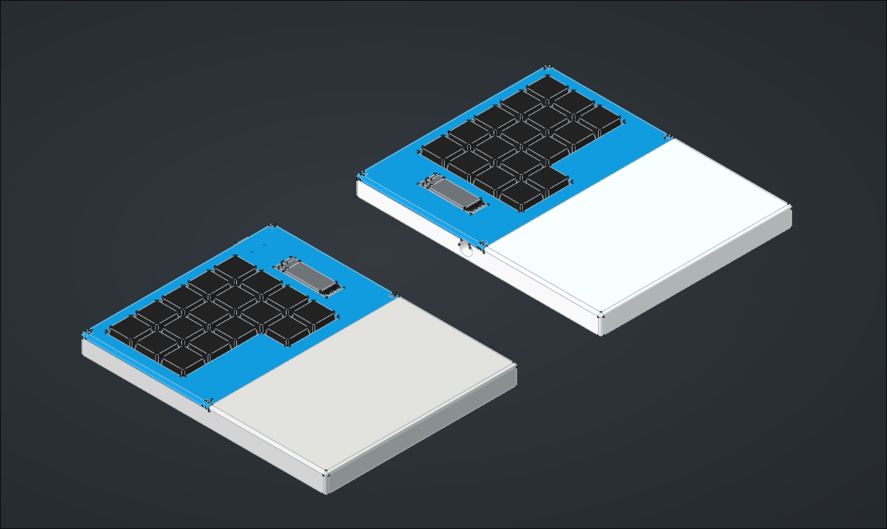
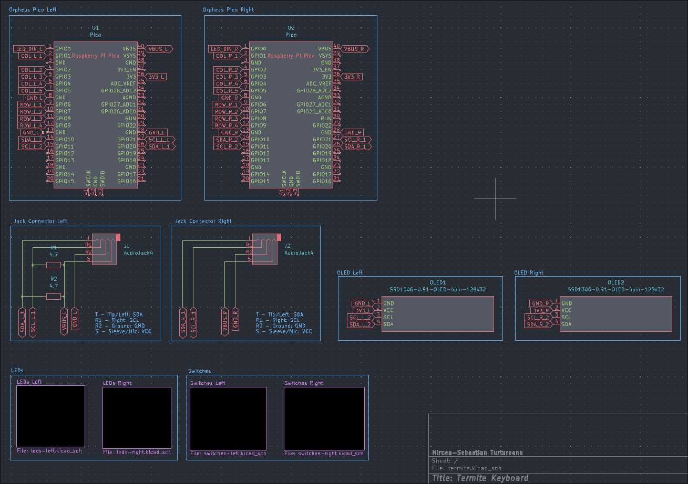
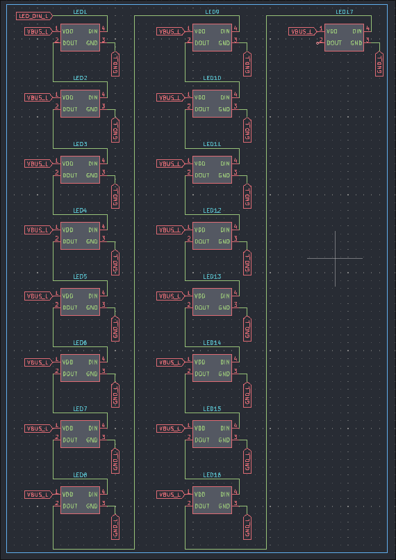
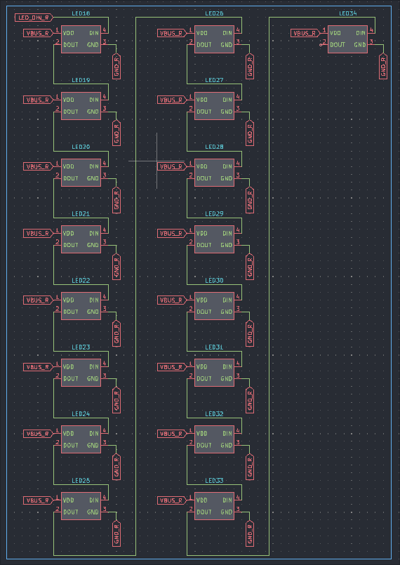
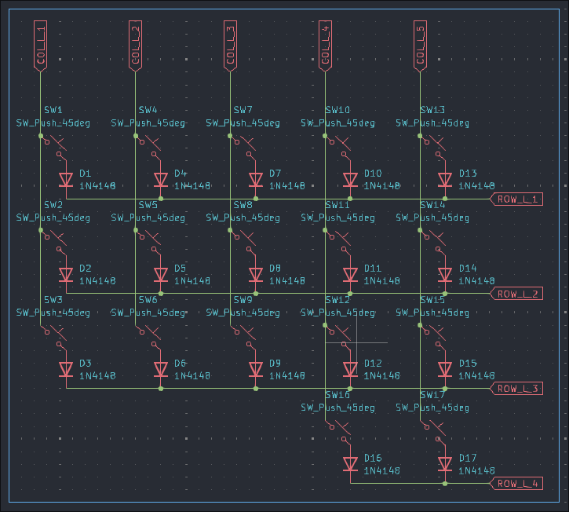
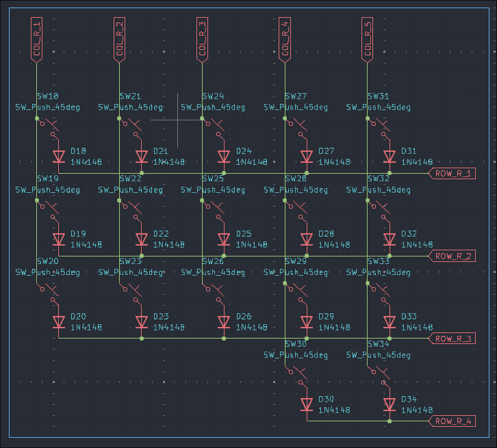
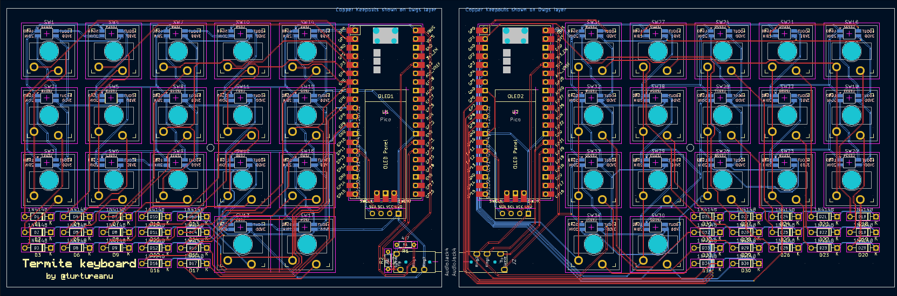
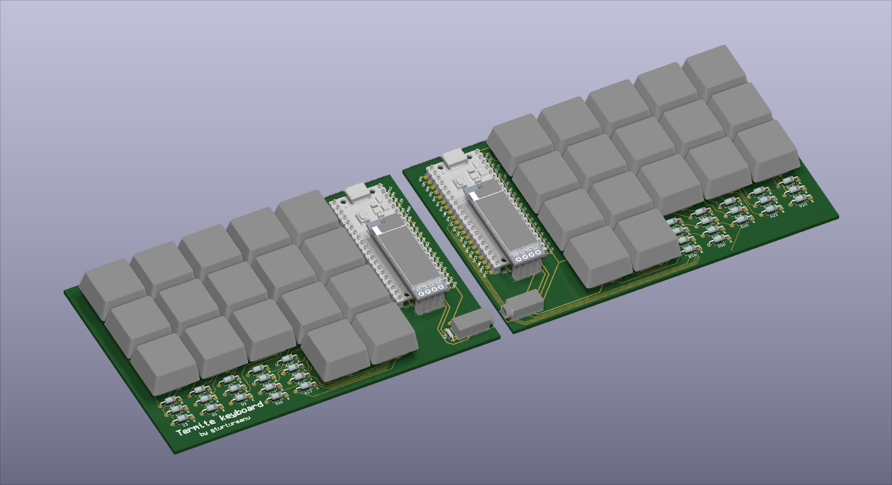

# Termite

> [!IMPORTANT]
> **July 26th was the date I submitted this keyboard for review, today on October 6th I noticed that I forgot to add the firmware (which would have been caught by a reviewer).**

> [!IMPORTANT]
> Made for [Hackboard](https://hackpad.hackclub.com/keyboard), which requires having made a macropad as part of [Hackpad *V2*](https://hackpad.hackclub.com/). \
> Here is my Hackpad V2 macropad: [Wirepad](https://github.com/turtureanu/hackpad/tree/main/hackpads/wirepad)

This is a 34-key ortholinear split keyboard with built-in wrist supports, one 0.91" OLED display on each half, and low-profile mechanical Cherry-MX type switches (Gateron). I use a TRRS cable to connect the two halves. The case is 3D printed and uses 5 M2 screws (four M2x12, one M2x4).

For the firmware I'm using KMK.

I created this keyboard as a replacement for my laptop's keyboard, which might fail soon. I wanted an ortholinear split keyboard with fewer keys that would fit the Engram keyboard layout. In the past I designed a similar keyboard with an 0.42" OLED display under each key (inspired by [PolyKybd Split 72](https://github.com/thpoll83/PolyKybd)), but I lost that design due to an accidental mass file deletion that BTRFS couldn't recover.

## Schematics

| Main Schematic                                    |
| ------------------------------------------------- |
|  |

| Left LEDs                                                          | Right LEDs                                                           |
| ------------------------------------------------------------------ | -------------------------------------------------------------------- |
|  |  |

| Left Switches                                                              | Right Switches                                                               |
| -------------------------------------------------------------------------- | ---------------------------------------------------------------------------- |
|  |  |

## PCB

> The gerber files can be found in `pcb/gerber`

## BOM

| Name                                                                                                   | Sourcing   | Category  | Amount             | Price (total including shipping) |
|--------------------------------------------------------------------------------------------------------|------------|-----------|--------------------|----------------------------------|
| Orpheus Pico                                                                                           | Hack Club  | MCU       | 2                  | $0                               |
| [Gateron Low Profile Switch 2.0 Red](https://www.aliexpress.com/item/1005005385675189.html)            | AliExpress | switches  | 35 (set)           | $15.85                           |
| [Transparent Keycaps with Black Bed](https://www.aliexpress.com/item/1005005984548224.html)            | AliExpress | keycaps   | 40 (4x 10 pcs set) | $17.55                           |
| [SK6812 MINI-E LED](https://www.aliexpress.com/item/1005003056797785.html)                             | AliExpress | misc      | 100 (set)          | $5.13                            |
| [0.91" White OLED Display](https://www.aliexpress.com/item/1005001572699049.html)                      | AliExpress | misc      | 2                  | $3.61                            |
| [1N4148 THT Diode](https://www.aliexpress.com/item/4000142272546.html)                                 | AliExpress | misc      | 100 (set)          | $1.98                            |
| [PJ-320A 3.5mm Female Jack Connector](https://www.aliexpress.com/item/4001161286315.html)              | AliExpress | misc      | 20 (set)           | $2.13                            |
| [M2x4 Hexagon Countersunk Head Screw with Nut](https://www.aliexpress.com/item/1005006883320887.html)  | AliExpress | fasteners | 50 (set)           | $1.75                            |
| [M2x12 Hexagon Countersunk Head Screw with Nut](https://www.aliexpress.com/item/1005006883320887.html) | AliExpress | fasteners | 50 (set)           | $2.46                            |

Switches & keycaps:

- switches: $0.452 per switch
- keycaps: $0.438 per keycap

Fasteners: $4.21 total

Misc:

- LEDs: $0.0513 per LED
- OLED displays: $1.805 per OLED display
- 1N4148 Diodes: 0.0198 per diode
- Jack connector: $0.1065 per jack connector

Misc total: $12.85

JLCPCB cost, if I were to order it myself: $30.04 total (for the entire keyboard, i.e. both halves)

## Credits

- Raspberry Pi Pico model (RPi_Pico_SMD_TH.kicad_mod): https://github.com/ncarandini/KiCad-RP-Pico/
- SK6812-MINI-E (modified): https://github.com/keebio/Keebio-Parts.pretty
- Gateron Switch (SW_Gateron_LowProfile_THT.kicad_mod / modified): https://github.com/siderakb/key-switches.pretty.git
- 0.91 OLED display: https://github.com/gorbachev/KiCad-SSD1306-0.91-OLED-4pin-128x32.pretty/blob/master/SSD1306-0.91-OLED-4pin-128x32.kicad_mod
- Diode (D_DO-35_SOD27_P7.62mm_Horizontal.kicad_mod / modified): https://gitlab.com/kicad/libraries/kicad-footprints/
- PJ-320A 3.5mm 4-pin Jack Connector: https://github.com/nathanhborger/PJ-320A_KiCad_Library
- TRRS-PJ-320A footprint: https://gitlab.com/kicad/libraries/kicad-footprints/
